# DOT Platform System Architecture Diagram

## 시스템 흐름도

아래 다이어그램은 DOT 플랫폼의 전체 시스템 아키텍처와 사용자 플로우를 보여줍니다.

- **파란색**: Owner (사업자) 기능
- **빨간색**: Worker (근로자) 기능
- **검은색**: 공통 기능

```mermaid
---
config:
  theme: base
  themeVariables:
    primaryColor: "#2962FF"
    primaryTextColor: "#fff"
    primaryBorderColor: "#2962FF"
    lineColor: "#5e5e5e"
    secondaryColor: "#D50000"
    tertiaryColor: "#fff"
---
flowchart LR
 subgraph s1["사업자 등록증"]
        n187["OWNER"]
  end
 subgraph s2["근로 계약서"]
        n188["WORKER"]
  end
    n3["근태관리"] --> n98["날짜 지정"] & n182["근태 뷰어 (달력)"]
    n2["근로자 관리"] --> n8["근로자 검색"] & n9["내 근로자 리스트"]
    n9 --> n10(["근로자 정보 수정"]) & n11["근로자 정보 다운로드"]
    n8 --> n12["근로자 추가"]
    n12 --> n13["근로자 정보 확인"]
    n13 --> n14["근로자 정보 입력"]
    n14 --> n15["근로자 추가 완료"]
    n16["스케줄 관리"] --- n17["스케줄 뷰어 (달력)"] & n169["일괄 업로드"] & n19["스케줄 다운로드"]
    n20["QR관리"] --- n21["QR 다운로드"] & n166["QR코드 미리보기"] & n23["QR 재발급"]
    n24["마이페이지"] --> n25["계정 관리"] & n29["설정"] & n30["업데이트"] & n31["구독관리"] & n37["로그아웃"]
    n25 --> n27["사업자 정보 수정"] & n28["로그인 정보 수정"] & n26["개인 정보 수정"] & n117["계정 탈퇴"]
    n32["인건비 관리"] --> n34["인건비 예측"] & n99["급여명세서 작성"] & n195["현제 인건비 내역"]
    n1["대시보드"] --> n38["현재 근태 상황"] & n39["근태 특이상황"] & n40["예상 인건비"] & n86["근로자 찾기"] & n131["공지사항"]
    n1 -. 커뮤니티 기능 추가 .- n162["커뮤니티"]
    n42["스캔"] --> n43(["출퇴근 기록 하기"])
    n43 --> n44["출근 하기"]
    n46["스케줄 확인"] --> n325["스케줄 뷰어 (달력)"]
    n47["마이 페이지"] --> n51["계정 관리"] & n54["설정"] & n55["업데이트"] & n56["로그아웃"]
    n51 --> n52["개인정보 수정"] & n53["로그인정보 수정"] & n105["계정 탈퇴"]
    n54 --> n59["근무 리마인드 설정"] & n60["세부 설정"] & n297["알림 설정"]
    n44 --> n61["휴게 시작"] & n62["외근 시작"] & n63["퇴근 하기"]
    n61 --> n64["휴게 종료"]
    n62 --> n65["외근종료"]
    n65 --> n61 & n63
    n64 --> n62 & n63
    n63 --> n66["근태기록 저장"]
    n68(["로그인 페이지"]) --> n120["소셜 로그인"] & n121["회원가입"] & n122["ID/PW 찾기"] & n233["아이디 입력창"]
    n38 --- n70["출근"] & n71["휴게"] & n72["퇴근"]
    n70 --> n73["현재 출근자 명단"]
    n71 --> n74["현재 휴게자 명단"]
    n72 --> n75["현재 퇴근자 명단"]
    n73 --- n76["출근자 개인 정보"] & n77["출근자 근태 정보"]
    n74 --- n78["휴게자 개인 정보"] & n79["휴게자 근태 정보"]
    n75 --- n80["퇴근자 개인 정보"] & n81["퇴근자 근태 정보"]
    n39 --- n82["지각"] & n83["결근"] & n84["초과"]
    n10 --> n87["기본"] & n88["고용"] & n89["급여"] & n90["서류"]
    n11 --> n93["다운로드 항목 선택"]
    n93 --> n95["다운로드"]
    n69["로그인"] --> n100["환경 설정의 우선페이지 설정 확인"]
    n100 --> n101["선정된 대시보드로 이동"]
    n48["매장 스케줄 확인"] --> n243["내 스케줄 선택"] & n241["다른 근로자 스케줄 선택"]
    n50["내 문서함"] --> n106["검색 입력창"] & n111["문서 분류"] & n246["문서 목록"]
    n35["내 문서함"] --> n108["문서 검색"] & n109["문서 다운로드"] & n110["문서 분류"]
    n99 --> n112["발송"] & n113["일괄 발송"] & n114["수정"] & n115["저장"]
    n118(["seeker"]) --> n305["헤더"]
    n124["내 문서함"] --> n125["문서 검색"] & n126["문서 다운로드"] & n127["문서 분류"]
    n132["알림"] --> n133["오늘 받은 알림"] & n134["이전 알림"] & n135["알림 검색"]
    n136(["알림"]) --> n137["오늘 받은 알림"] & n138["이전 알림"] & n139["알림 검색"]
    n129(["알림"]) --> n140["오늘 받은 알림"] & n141["이전 알림"] & n142["알림 검색"]
    n146["마이 페이지"] --> n147["계정 관리"] & n148["설정"] & n149["업데이트"] & n303["로그아웃"]
    n147 --> n150["개인정보 수정"] & n151["로그인 정보 수정"] & n152["계정 탈퇴"]
    n118 -- <br> --> n153["대쉬보드"]
    n156["대시보드"] --> n157["공지사항"] & n158["오늘의 근태기록"] & n159["오늘의 스케줄"] & n160["내일의 스케줄"]
    n156 -. 커뮤니티 기능 추가 .- n161["커뮤니티"]
    n153 -. 커뮤니티 기능 추가 .- n163["커뮤니티"]
    n153 --> n164["공지사항"] & n124 & n123["사업자, 법인 등록"]
    n165["사이드 메뉴"] --> n3 & n16 & n20 & n32 & n35 & n2
    n167["헤더"] --> n168["어플 이름 (홈 키)"] & n24 & n132 & n145(["채팅"])
    n17 --> n170["해당 일에 스케<br>줄이 비어있나?"]
    n170 == YES ==> n171(["스케줄 추가"])
    n170 == NO ==> n172["스케줄 목록"]
    n169 --> n173["근로 계약서 연동하기"]
    n19 --> n174["날짜 지정"]
    n174 --> n175["다운로드"]
    n171 --> n176["근로자 선택"] & n177["날짜 입력"] & n178["근무시간 설정"]
    n172 --> n181["스케줄 수정"] & n214["스케줄 삭제"]
    n182 --> n183["해당 일에 스케<br>줄이 비어있나?"]
    n183 == YES ==> n184(["근태 추가"])
    n183 == NO ==> n185(["근태 목록"])
    n185 --> n4["근태 수정"]
    s1 --> n1 & n36["worker로 전환"] & n167 & n165
    s1 -. 구이구직 페이지 연동 시 .- n155["구인구직 페이지"]
    s2 --> n190["헤더"] & n191["사이드메뉴"] & n156 & n42 & n67["사업자 등록"]
    s2 -. 구인구직 연동 시 .- n228["구인구직 페이지"]
    s2 -. 권한 위임장 받으면 .- n226["manager 기능 추가"]
    n191 --> n50 & n46 & n45["근태 확인"]
    n190 --> n192(["채팅"]) & n47 & n136 & n193["어플 이름 (홈키)"]
    n34 --> n194["인건비 예측 세부내역"]
    n195 --> n196["날짜 지정"]
    n196 --> n197["조회"] & n316["다운로드"]
    n181 --> n201["근로자 선택"] & n203["근무 시간 수정"] & n213["날짜 입력"]
    n4 --> n215["날짜 입력"] & n216["근로자 선택"] & n217["근태 시간 입력"] & n218["상태 수정"]
    n218 --> n219["정상"] & n220["지각"] & n221["결근"] & n222["조퇴"]
    n120 --- n223["네이버"] & n225["구글"] & n224["카카오톡"]
    s2 -. 사업자 등록하면 .- n227["owner 대시보드로 로 전환 가능"]
    n229(["로그아웃/앱구동"]) --> n68
    n122 --> n232["메일 연동<br>(메일 주소 자동 입력)"]
    n233 --> n234["비밀번호 입력창"]
    n234 --> n69
    n168 --> n1
    n139 --> n238["입력창"]
    n238 --> n239["검색"]
    n241 --> n242["스캐줄 스왑 신청"]
    n246 --> n107["문서 다운로드"]
    n106 --> n247["검색"]
    n157 --> n251["공지사항 목록"]
    n158 --> n45
    n159 --> n46
    n160 --> n46
    n28 --> n252["저장된 로그인 정보"]
    n252 --> n253["수정"]
    n131 --> n255["공지사항 목록"]
    n30 --> n256["버전 벙보"] & n257["업데이트 하기"]
    n55 --> n258["버전 정보"] & n259["업데이트 하기"]
    n56 --> n260["로그인 페이지"]
    n37 --> n261["로그인 페이지"]
    n27 --> n262["저장된 사업자 정보"]
    n262 --> n263["수정"]
    n26 --> n264["저장된 개인 정보"]
    n264 --> n265["수정"]
    n21 --> n266["PNG"] & n267["PDF"]
    n87 --> n268["이름"] & n269["생년월일"] & n270["연락처"] & n271["근로자 색상"]
    n176 --> n272["저장"]
    n177 --> n272
    n178 --> n272
    n201 --> n273["저장"]
    n203 --> n273
    n213 --> n273
    n214 --> n273
    n88 --> n274["직급"] & n275["입사일"] & n276["고용형태"] & n277["상태"]
    n276 --> n278["정규직"] & n279["아르바이트"]
    n277 --> n280["재직"] & n281["휴직"] & n282["퇴사"]
    n89 --> n283["급여형태"] & n286["계약 급여"] & n287["은행명"] & n288["계좌번호"]
    n283 --> n284["월급"] & n285["시급"]
    n90 --> n289["근로계약서"] & n290["통장사본"]
    n289 --> n291["파일 선택"]
    n290 --> n292["파일 선택"]
    n268 --> n293["저장"]
    n269 --> n293
    n270 --> n293
    n271 --> n293
    n274 --> n293
    n275 --> n293
    n278 --> n293
    n279 --> n293
    n280 --> n293
    n281 --> n293
    n282 --> n293
    n284 --> n293
    n285 --> n293
    n287 --> n293
    n288 --> n293
    n286 --> n293
    n291 --> n293
    n292 --> n293
    n215 --> n294["저장"]
    n216 --> n294
    n219 --> n294
    n217 --> n294
    n220 --> n294
    n221 --> n294
    n222 --> n294
    n29 --> n295["세부 설정"] & n296["알림 설정"]
    n149 --> n298["버전 정보"] & n299["업데이트 하기"]
    n148 --> n300["세부 설정"] & n301["알림 설정"]
    n164 --> n302["공지사항 목록"]
    n303 --> n304["로그인 페이지"]
    n305 --> n146 & n143(["체팅"]) & n129 & n306["어플 이름 (홈키)"]
    n263 --> n307["저장"]
    n253 --> n308["저장"]
    n265 --> n309["저장"]
    n86 --> n310["근로자 검색"]
    n40 --> n311["인건비 예측"]
    n175 --> n312["엑셀파일로 다운로드 완료"]
    n266 --> n313["PNG 파일로 다운로드 완료"]
    n23 --> n314["재발급 신청하기"]
    n267 --> n315["PNG 파일로 다운로드 완료"]
    n316 --> n317["엑셀 파일로 다운로드 완료"]
    n95 --> n318["엑셀 파일로 다운로드 완료"]
    n98 --> n319["다운로드"]
    n319 --> n320["엑셀 파일로 다운로드 완료"]
    n193 --> n156
    n67 --> n321["개인 사업자 등록"] & n322["법인 사업자 등록"]
    n322 --> n323["대표자 본인인지 확인"]
    n245["날짜 선택"] --> n326["휴무 신청"]
    n325 --> n49["개인 스케줄 확인"] & n48 & n245
    n45 --> n327["근태 뷰어 (달력)"]
    n327 --> n328["세부 근태 내용 확인"]
    n251 --> n329["공지사항 확인"]
    n49 --> n330["내 스케줄 선택"]
    n243 --> n331["스케줄 수정 요청"]
    n328 --> n332["근태 수정 요청"]
    n330 --> n333["스케줄 수정 요청"]
    n329 --> n334["확인 체크하기"]
    n337["상태 수정"] --> n338["정상"] & n339["지각"] & n340["결근"] & n341["조퇴"]
    n335["근로자 선택"] --> n342["저장"]
    n338 --> n342
    n336["근태 시간 입력"] --> n342
    n339 --> n342
    n340 --> n342
    n341 --> n342
    n184 --> n337 & n335 & n336
    n82 --> n343["현재 지각자 명단"]
    n83 --> n344["현재 결근자 명단"]
    n84 --> n345["현재 초과근무자 명단"]
    n343 --> n346["지각자 개인정보"]
    n344 --> n347["결근자 개인정보"]
    n345 --> n348["초과근무자 개인정보"]
    n306 --> n153

    %% 스타일 적용
    classDef ownerStyle fill:#2962FF,stroke:#2962FF,color:#fff
    classDef workerStyle fill:#D50000,stroke:#D50000,color:#fff
    classDef commonStyle fill:#888,stroke:#333,color:#fff

    class n1,n2,n3,n16,n20,n24,n25,n29,n30,n31,n32,n35,n99,n162,n165,n167 ownerStyle
    class n45,n46,n47,n50,n51,n54,n55,n156,n161,n190,n191,n228 workerStyle
```

## 주요 기능 흐름

### Owner (사업자) 주요 기능
- **근태관리**: 근로자들의 출퇴근 기록 확인 및 관리
- **스케줄 관리**: 근무 일정 생성 및 수정
- **인건비 관리**: 급여 계산 및 명세서 발행
- **QR 관리**: 출퇴근용 QR 코드 생성 및 관리

### Worker (근로자) 주요 기능
- **출퇴근 기록**: QR 스캔을 통한 출퇴근
- **스케줄 확인**: 본인 및 동료 스케줄 확인
- **근태 확인**: 본인의 근태 기록 조회
- **문서함**: 근로계약서, 급여명세서 등 문서 관리

### 공통 기능
- **로그인/회원가입**: 소셜 로그인 지원
- **마이페이지**: 계정 정보 관리
- **알림**: 시스템 알림 및 공지사항
- **채팅**: 사내 메시징 기능