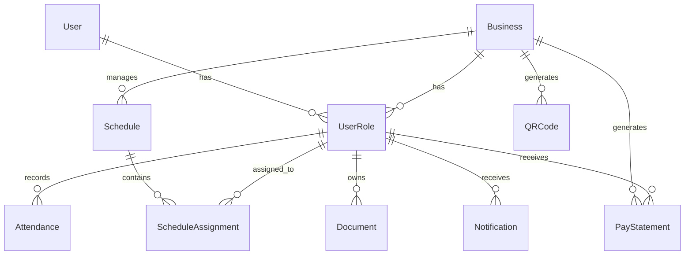

# Data Model: DOT Platform

**Branch**: `001-dot` | **Date**: 2025-09-16
**Purpose**: 데이터베이스 스키마 및 엔티티 관계 정의

## Entity Relationship Diagram


## 1. User (사용자)
사용자 기본 정보 및 인증 정보를 저장합니다.

```sql
CREATE TABLE users (
  id SERIAL PRIMARY KEY,
  email VARCHAR(255) UNIQUE NOT NULL,
  phone VARCHAR(20) UNIQUE,
  password_hash VARCHAR(255) NOT NULL,
  name VARCHAR(100) NOT NULL,
  profile_image_url VARCHAR(500),
  status VARCHAR(20) NOT NULL DEFAULT 'active',
  -- 'active', 'inactive', 'suspended'

  email_verified BOOLEAN DEFAULT FALSE,
  phone_verified BOOLEAN DEFAULT FALSE,

  created_at TIMESTAMP NOT NULL DEFAULT CURRENT_TIMESTAMP,
  updated_at TIMESTAMP NOT NULL DEFAULT CURRENT_TIMESTAMP,
  last_login_at TIMESTAMP,

  CONSTRAINT chk_status CHECK (status IN ('active', 'inactive', 'suspended'))
);

CREATE INDEX idx_users_email ON users(email);
CREATE INDEX idx_users_phone ON users(phone);
CREATE INDEX idx_users_status ON users(status);
```

### 검증 규칙
- 이메일: 유효한 이메일 형식
- 전화번호: 한국 전화번호 형식 (010-XXXX-XXXX)
- 비밀번호: 최소 8자, 대소문자, 숫자, 특수문자 포함
- 이름: 2-50자, 한글 또는 영문

## 2. Business (사업장)
사업장 정보를 저장합니다.

```sql
CREATE TABLE businesses (
  id SERIAL PRIMARY KEY,
  name VARCHAR(100) NOT NULL,
  registration_number VARCHAR(20) UNIQUE NOT NULL,
  business_type VARCHAR(50) NOT NULL,
  -- '개인사업자', '법인사업자'

  industry_type VARCHAR(50),
  -- '카페', '레스토랑', '바', '베이커리'

  address TEXT NOT NULL,
  location POINT NOT NULL, -- PostGIS
  phone VARCHAR(20),

  subscription_plan VARCHAR(50) DEFAULT 'free',
  subscription_expires_at TIMESTAMP,

  timezone VARCHAR(50) DEFAULT 'Asia/Seoul',
  language VARCHAR(10) DEFAULT 'ko',

  settings JSONB DEFAULT '{}',

  created_at TIMESTAMP NOT NULL DEFAULT CURRENT_TIMESTAMP,
  updated_at TIMESTAMP NOT NULL DEFAULT CURRENT_TIMESTAMP,

  CONSTRAINT chk_business_type CHECK (
    business_type IN ('개인사업자', '법인사업자')
  ),
  CONSTRAINT chk_industry_type CHECK (
    industry_type IN ('카페', '레스토랑', '바', '베이커리', NULL)
  )
);

CREATE INDEX idx_businesses_registration ON businesses(registration_number);
CREATE SPATIAL INDEX idx_businesses_location ON businesses USING GIST(location);
```

## 3. UserRole (사용자 역할)
사용자와 사업장 간의 역할 매핑을 관리합니다.

```sql
CREATE TABLE user_roles (
  id SERIAL PRIMARY KEY,
  user_id INTEGER NOT NULL REFERENCES users(id) ON DELETE CASCADE,
  business_id INTEGER REFERENCES businesses(id) ON DELETE CASCADE,
  role_type VARCHAR(20) NOT NULL,
  -- 'owner', 'manager', 'worker', 'seeker'

  is_active BOOLEAN DEFAULT TRUE,
  permissions JSONB DEFAULT '[]',

  valid_from TIMESTAMP NOT NULL DEFAULT CURRENT_TIMESTAMP,
  valid_until TIMESTAMP,

  created_at TIMESTAMP NOT NULL DEFAULT CURRENT_TIMESTAMP,
  updated_at TIMESTAMP NOT NULL DEFAULT CURRENT_TIMESTAMP,

  UNIQUE(user_id, business_id, role_type),

  CONSTRAINT chk_role_type CHECK (
    role_type IN ('owner', 'manager', 'worker', 'seeker')
  ),
  CONSTRAINT chk_seeker_no_business CHECK (
    (role_type = 'seeker' AND business_id IS NULL) OR
    (role_type != 'seeker' AND business_id IS NOT NULL)
  )
);

CREATE INDEX idx_user_roles_user ON user_roles(user_id);
CREATE INDEX idx_user_roles_business ON user_roles(business_id);
CREATE INDEX idx_user_roles_type ON user_roles(role_type);
```

## 4. Attendance (근태)
출퇴근 및 근무 상태를 기록합니다.

```sql
CREATE TABLE attendances (
  id SERIAL PRIMARY KEY,
  business_id INTEGER NOT NULL REFERENCES businesses(id),
  user_id INTEGER NOT NULL REFERENCES users(id),
  user_role_id INTEGER NOT NULL REFERENCES user_roles(id),

  date DATE NOT NULL,

  check_in_time TIMESTAMP,
  check_in_location POINT,
  check_in_method VARCHAR(20), -- 'qr', 'manual', 'gps'

  check_out_time TIMESTAMP,
  check_out_location POINT,
  check_out_method VARCHAR(20),

  break_start_times TIMESTAMP[],
  break_end_times TIMESTAMP[],
  break_locations POINT[],

  outside_work_start_times TIMESTAMP[],
  outside_work_end_times TIMESTAMP[],
  outside_work_locations POINT[],

  status VARCHAR(20) NOT NULL DEFAULT 'scheduled',
  -- 'scheduled', 'checked_in', 'on_break', 'outside_work', 'checked_out'

  total_work_minutes INTEGER,
  total_break_minutes INTEGER,
  overtime_minutes INTEGER,

  notes TEXT,
  anomalies JSONB DEFAULT '[]',
  -- [{type: 'late', minutes: 30}, {type: 'early_leave', minutes: 60}]

  created_at TIMESTAMP NOT NULL DEFAULT CURRENT_TIMESTAMP,
  updated_at TIMESTAMP NOT NULL DEFAULT CURRENT_TIMESTAMP,

  UNIQUE(business_id, user_id, date),

  CONSTRAINT chk_status CHECK (
    status IN ('scheduled', 'checked_in', 'on_break',
              'outside_work', 'checked_out')
  )
);

CREATE INDEX idx_attendances_business_date ON attendances(business_id, date);
CREATE INDEX idx_attendances_user_date ON attendances(user_id, date);
CREATE INDEX idx_attendances_status ON attendances(status);
```

## 5. Schedule (스케줄)
근무 스케줄을 관리합니다.

```sql
CREATE TABLE schedules (
  id SERIAL PRIMARY KEY,
  business_id INTEGER NOT NULL REFERENCES businesses(id),

  name VARCHAR(100),
  start_date DATE NOT NULL,
  end_date DATE NOT NULL,

  is_template BOOLEAN DEFAULT FALSE,
  template_name VARCHAR(100),

  recurrence_pattern VARCHAR(20),
  -- 'daily', 'weekly', 'monthly', 'custom'
  recurrence_config JSONB,

  is_published BOOLEAN DEFAULT FALSE,
  published_at TIMESTAMP,

  created_by INTEGER REFERENCES users(id),
  created_at TIMESTAMP NOT NULL DEFAULT CURRENT_TIMESTAMP,
  updated_at TIMESTAMP NOT NULL DEFAULT CURRENT_TIMESTAMP,

  CONSTRAINT chk_date_range CHECK (end_date >= start_date)
);

CREATE INDEX idx_schedules_business ON schedules(business_id);
CREATE INDEX idx_schedules_dates ON schedules(start_date, end_date);
```

## 6. ScheduleAssignment (스케줄 할당)
개별 근무 할당을 관리합니다.

```sql
CREATE TABLE schedule_assignments (
  id SERIAL PRIMARY KEY,
  schedule_id INTEGER NOT NULL REFERENCES schedules(id) ON DELETE CASCADE,
  user_role_id INTEGER NOT NULL REFERENCES user_roles(id),

  date DATE NOT NULL,
  shift_start TIME NOT NULL,
  shift_end TIME NOT NULL,

  break_minutes INTEGER DEFAULT 0,

  status VARCHAR(20) DEFAULT 'assigned',
  -- 'assigned', 'swap_requested', 'leave_requested', 'confirmed'

  notes TEXT,

  created_at TIMESTAMP NOT NULL DEFAULT CURRENT_TIMESTAMP,
  updated_at TIMESTAMP NOT NULL DEFAULT CURRENT_TIMESTAMP,

  UNIQUE(schedule_id, user_role_id, date)
);

CREATE INDEX idx_schedule_assignments_schedule ON schedule_assignments(schedule_id);
CREATE INDEX idx_schedule_assignments_user_role ON schedule_assignments(user_role_id);
CREATE INDEX idx_schedule_assignments_date ON schedule_assignments(date);
```

## 7. Document (문서)
사용자 문서를 관리합니다.

```sql
CREATE TABLE documents (
  id SERIAL PRIMARY KEY,
  user_id INTEGER NOT NULL REFERENCES users(id),
  business_id INTEGER REFERENCES businesses(id),

  filename VARCHAR(255) NOT NULL,
  original_filename VARCHAR(255) NOT NULL,
  file_type VARCHAR(50) NOT NULL,
  file_size INTEGER NOT NULL, -- bytes

  storage_path TEXT NOT NULL,

  category VARCHAR(50),
  -- '계약서', '증명서', '급여명세서', '기타'

  is_public BOOLEAN DEFAULT FALSE,

  expires_at TIMESTAMP, -- 3년 후 자동 설정

  created_at TIMESTAMP NOT NULL DEFAULT CURRENT_TIMESTAMP,
  updated_at TIMESTAMP NOT NULL DEFAULT CURRENT_TIMESTAMP,

  CONSTRAINT chk_file_size CHECK (file_size <= 10485760), -- 10MB
  CONSTRAINT chk_file_type CHECK (
    file_type IN ('pdf', 'jpg', 'jpeg', 'png', 'doc', 'docx')
  )
);

CREATE INDEX idx_documents_user ON documents(user_id);
CREATE INDEX idx_documents_business ON documents(business_id);
CREATE INDEX idx_documents_category ON documents(category);
CREATE INDEX idx_documents_expires ON documents(expires_at);
```

## 8. QRCode (QR 코드)
사업장별 QR 코드를 관리합니다.

```sql
CREATE TABLE qr_codes (
  id SERIAL PRIMARY KEY,
  business_id INTEGER NOT NULL REFERENCES businesses(id),

  code_data TEXT NOT NULL UNIQUE,
  qr_image_url TEXT,

  location POINT NOT NULL,
  allowed_radius INTEGER DEFAULT 50, -- meters

  is_active BOOLEAN DEFAULT TRUE,
  expires_at TIMESTAMP,

  usage_count INTEGER DEFAULT 0,
  last_used_at TIMESTAMP,

  created_at TIMESTAMP NOT NULL DEFAULT CURRENT_TIMESTAMP,
  updated_at TIMESTAMP NOT NULL DEFAULT CURRENT_TIMESTAMP
);

CREATE INDEX idx_qr_codes_business ON qr_codes(business_id);
CREATE INDEX idx_qr_codes_code ON qr_codes(code_data);
CREATE INDEX idx_qr_codes_active ON qr_codes(is_active);
```

## 9. Notification (알림)
알림 설정 및 이력을 관리합니다.

```sql
CREATE TABLE notifications (
  id SERIAL PRIMARY KEY,
  user_id INTEGER NOT NULL REFERENCES users(id),
  business_id INTEGER REFERENCES businesses(id),

  type VARCHAR(50) NOT NULL,
  -- 'schedule_change', 'attendance_reminder', 'announcement', 'payroll'

  channel VARCHAR(20) NOT NULL DEFAULT 'email',
  -- 'email', 'push', 'sms'

  subject VARCHAR(200),
  content TEXT NOT NULL,

  is_read BOOLEAN DEFAULT FALSE,
  read_at TIMESTAMP,

  sent_at TIMESTAMP,
  failed_at TIMESTAMP,
  error_message TEXT,

  created_at TIMESTAMP NOT NULL DEFAULT CURRENT_TIMESTAMP
);

CREATE INDEX idx_notifications_user ON notifications(user_id);
CREATE INDEX idx_notifications_type ON notifications(type);
CREATE INDEX idx_notifications_read ON notifications(is_read);
CREATE INDEX idx_notifications_created ON notifications(created_at DESC);
```

## 10. PayStatement (급여명세서)
급여 계산 및 명세서를 관리합니다.

```sql
CREATE TABLE pay_statements (
  id SERIAL PRIMARY KEY,
  business_id INTEGER NOT NULL REFERENCES businesses(id),
  user_id INTEGER NOT NULL REFERENCES users(id),

  period_start DATE NOT NULL,
  period_end DATE NOT NULL,

  total_work_hours DECIMAL(10,2) NOT NULL,
  regular_hours DECIMAL(10,2) NOT NULL,
  overtime_hours DECIMAL(10,2) DEFAULT 0,

  hourly_rate DECIMAL(10,2) NOT NULL,
  overtime_rate DECIMAL(10,2),

  base_pay DECIMAL(12,2) NOT NULL,
  overtime_pay DECIMAL(12,2) DEFAULT 0,
  bonuses DECIMAL(12,2) DEFAULT 0,
  deductions DECIMAL(12,2) DEFAULT 0,

  tax_amount DECIMAL(12,2) DEFAULT 0,
  insurance_amount DECIMAL(12,2) DEFAULT 0,

  net_pay DECIMAL(12,2) NOT NULL,

  payment_date DATE,
  payment_method VARCHAR(50),
  -- 'bank_transfer', 'cash', 'check'

  status VARCHAR(20) DEFAULT 'draft',
  -- 'draft', 'approved', 'sent', 'paid'

  notes TEXT,

  created_at TIMESTAMP NOT NULL DEFAULT CURRENT_TIMESTAMP,
  updated_at TIMESTAMP NOT NULL DEFAULT CURRENT_TIMESTAMP,

  UNIQUE(business_id, user_id, period_start, period_end)
);

CREATE INDEX idx_pay_statements_business ON pay_statements(business_id);
CREATE INDEX idx_pay_statements_user ON pay_statements(user_id);
CREATE INDEX idx_pay_statements_period ON pay_statements(period_start, period_end);
CREATE INDEX idx_pay_statements_status ON pay_statements(status);
```

## 데이터 보존 정책

### 3년 보관 규칙
```sql
-- 자동 만료 설정
CREATE OR REPLACE FUNCTION set_document_expiry()
RETURNS TRIGGER AS $$
BEGIN
  NEW.expires_at := NEW.created_at + INTERVAL '3 years';
  RETURN NEW;
END;
$$ LANGUAGE plpgsql;

CREATE TRIGGER set_document_expiry_trigger
BEFORE INSERT ON documents
FOR EACH ROW
EXECUTE FUNCTION set_document_expiry();

-- 정기적인 정리 작업
CREATE OR REPLACE FUNCTION cleanup_expired_data()
RETURNS void AS $$
BEGIN
  -- 만료된 문서 삭제
  DELETE FROM documents WHERE expires_at < CURRENT_TIMESTAMP;

  -- 3년 지난 근태 기록 아카이브
  INSERT INTO attendances_archive
  SELECT * FROM attendances
  WHERE created_at < CURRENT_TIMESTAMP - INTERVAL '3 years';

  DELETE FROM attendances
  WHERE created_at < CURRENT_TIMESTAMP - INTERVAL '3 years';

  -- 3년 지난 급여명세서 아카이브
  INSERT INTO pay_statements_archive
  SELECT * FROM pay_statements
  WHERE created_at < CURRENT_TIMESTAMP - INTERVAL '3 years';

  DELETE FROM pay_statements
  WHERE created_at < CURRENT_TIMESTAMP - INTERVAL '3 years';
END;
$$ LANGUAGE plpgsql;
```

## 인덱스 전략

### 성능 최적화 인덱스
```sql
-- 복합 인덱스
CREATE INDEX idx_attendances_business_user_date
ON attendances(business_id, user_id, date DESC);

CREATE INDEX idx_schedules_business_published
ON schedules(business_id, is_published);

CREATE INDEX idx_user_roles_active
ON user_roles(business_id, is_active)
WHERE is_active = TRUE;

-- 부분 인덱스
CREATE INDEX idx_attendances_today
ON attendances(business_id, status)
WHERE date = CURRENT_DATE;

CREATE INDEX idx_notifications_unread
ON notifications(user_id, created_at DESC)
WHERE is_read = FALSE;
```

## 트랜잭션 전략

### 중요 작업의 트랜잭션 처리
```sql
-- 출근 체크인 트랜잭션
BEGIN;
  -- 1. 출석 기록 생성/업데이트
  INSERT INTO attendances (business_id, user_id, date, check_in_time, ...)
  VALUES ($1, $2, $3, $4, ...)
  ON CONFLICT (business_id, user_id, date)
  DO UPDATE SET check_in_time = $4, status = 'checked_in';

  -- 2. QR 코드 사용 카운트 증가
  UPDATE qr_codes
  SET usage_count = usage_count + 1, last_used_at = NOW()
  WHERE id = $5;

  -- 3. 실시간 알림 생성
  INSERT INTO notifications (user_id, type, content)
  VALUES ($2, 'attendance', '출근이 확인되었습니다');
COMMIT;
```

## 마이그레이션 전략

```javascript
// Knex.js 마이그레이션 예시
exports.up = function(knex) {
  return knex.schema
    .createTable('users', table => {
      table.increments('id').primary();
      table.string('email', 255).unique().notNullable();
      // ... 나머지 필드
    })
    .then(() => {
      return knex.raw('CREATE EXTENSION IF NOT EXISTS postgis');
    });
};

exports.down = function(knex) {
  return knex.schema.dropTableIfExists('users');
};
```