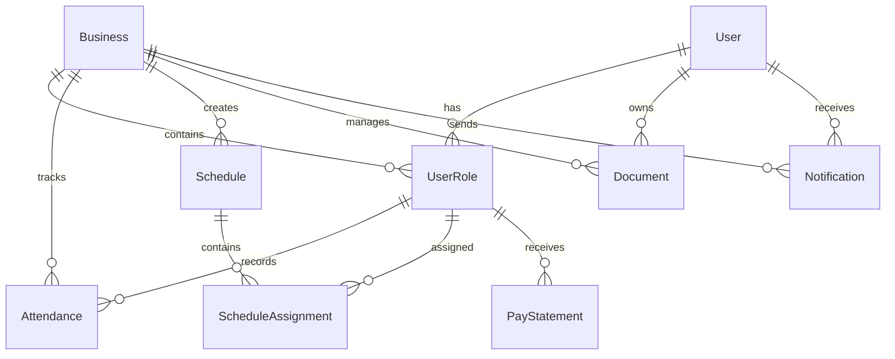

# Data Model: DOT Platform V0.1

**Branch**: `002-` | **Date**: 2025-09-16
**Purpose**: 데이터베이스 스키마 및 엔티티 관계 정의

## Entity Relationship Diagram



## Core Entities

### 1. User (사용자)
**설명**: 시스템의 모든 사용자 정보를 저장하는 기본 엔티티

| Field | Type | Constraints | Description |
|-------|------|------------|-------------|
| id | SERIAL | PRIMARY KEY | 사용자 고유 ID |
| email | VARCHAR(255) | UNIQUE, NOT NULL | 로그인용 이메일 |
| password_hash | VARCHAR(255) | NOT NULL | bcrypt 해시된 비밀번호 |
| name | VARCHAR(100) | NOT NULL | 사용자 실명 |
| phone | VARCHAR(20) | | 전화번호 (010-xxxx-xxxx) |
| profile_image_url | VARCHAR(500) | | 프로필 이미지 URL |
| status | ENUM | DEFAULT 'active' | active, inactive, suspended |
| email_verified | BOOLEAN | DEFAULT false | 이메일 인증 여부 |
| phone_verified | BOOLEAN | DEFAULT false | 전화번호 인증 여부 |
| created_at | TIMESTAMP | DEFAULT NOW() | 가입일시 |
| updated_at | TIMESTAMP | DEFAULT NOW() | 수정일시 |
| last_login_at | TIMESTAMP | | 마지막 로그인 시간 |

**인덱스**:
- `idx_user_email` ON email
- `idx_user_phone` ON phone
- `idx_user_status` ON status

**검증 규칙**:
- 이메일 형식 검증 (regex: /^[^\s@]+@[^\s@]+\.[^\s@]+$/)
- 비밀번호 최소 8자, 대소문자, 숫자, 특수문자 포함
- 전화번호 형식: 010-xxxx-xxxx

### 2. Business (사업장)
**설명**: 식당, 카페 등 사업장 정보

| Field | Type | Constraints | Description |
|-------|------|------------|-------------|
| id | SERIAL | PRIMARY KEY | 사업장 고유 ID |
| name | VARCHAR(100) | NOT NULL | 사업장명 |
| registration_number | VARCHAR(20) | UNIQUE | 사업자등록번호 |
| business_type | ENUM | NOT NULL | 개인사업자, 법인사업자 |
| industry_type | ENUM | | 카페, 레스토랑, 바, 베이커리 |
| address | TEXT | NOT NULL | 주소 |
| location | POINT | NOT NULL | GPS 좌표 (PostGIS) |
| phone | VARCHAR(20) | | 사업장 전화번호 |
| subscription_plan | VARCHAR(50) | DEFAULT 'free' | 요금제 (MVP: free only) |
| subscription_expires_at | TIMESTAMP | | 구독 만료일 |
| timezone | VARCHAR(50) | DEFAULT 'Asia/Seoul' | 시간대 |
| language | VARCHAR(10) | DEFAULT 'ko' | 기본 언어 |
| settings | JSONB | DEFAULT '{}' | 사업장별 설정 |
| created_at | TIMESTAMP | DEFAULT NOW() | 생성일시 |
| updated_at | TIMESTAMP | DEFAULT NOW() | 수정일시 |

**인덱스**:
- `idx_business_registration` ON registration_number
- `idx_business_location` ON location USING GIST
- `idx_business_type` ON business_type, industry_type

**검증 규칙**:
- 사업자등록번호 형식 검증 (xxx-xx-xxxxx)
- GPS 좌표 유효성 검증 (위도: -90~90, 경도: -180~180)

### 3. UserRole (사용자 역할)
**설명**: 사용자와 사업장을 연결하며 역할을 정의

| Field | Type | Constraints | Description |
|-------|------|------------|-------------|
| id | SERIAL | PRIMARY KEY | 역할 고유 ID |
| user_id | INTEGER | FOREIGN KEY | User.id 참조 |
| business_id | INTEGER | FOREIGN KEY, NULL | Business.id 참조 (Seeker는 NULL) |
| role_type | ENUM | NOT NULL | owner, manager, worker, seeker |
| permissions | JSONB | DEFAULT '[]' | 세부 권한 목록 |
| is_active | BOOLEAN | DEFAULT true | 활성 상태 |
| wage_type | ENUM | | hourly, monthly, daily |
| wage_amount | DECIMAL(10,2) | | 급여액 |
| start_date | DATE | DEFAULT TODAY() | 역할 시작일 |
| end_date | DATE | | 역할 종료일 |
| created_at | TIMESTAMP | DEFAULT NOW() | 생성일시 |
| updated_at | TIMESTAMP | DEFAULT NOW() | 수정일시 |

**인덱스**:
- `idx_user_role_user` ON user_id
- `idx_user_role_business` ON business_id
- `idx_user_role_active` ON is_active
- `unique_user_business_role` UNIQUE (user_id, business_id, role_type)

**검증 규칙**:
- Seeker 역할은 business_id가 NULL이어야 함
- 동일 사업장에서 동일 역할 중복 불가

### 4. Attendance (근태 기록)
**설명**: 출퇴근, 휴게 시간 등 근태 정보

| Field | Type | Constraints | Description |
|-------|------|------------|-------------|
| id | SERIAL | PRIMARY KEY | 근태 기록 ID |
| business_id | INTEGER | FOREIGN KEY, NOT NULL | Business.id 참조 |
| user_id | INTEGER | FOREIGN KEY, NOT NULL | User.id 참조 |
| user_role_id | INTEGER | FOREIGN KEY, NOT NULL | UserRole.id 참조 |
| date | DATE | NOT NULL | 근무일자 |
| check_in_time | TIMESTAMP | | 출근 시간 |
| check_in_location | POINT | | 출근 위치 (GPS) |
| check_in_method | VARCHAR(20) | | qr, manual, auto |
| check_out_time | TIMESTAMP | | 퇴근 시간 |
| check_out_location | POINT | | 퇴근 위치 (GPS) |
| check_out_method | VARCHAR(20) | | qr, manual, auto |
| break_start_times | TIMESTAMP[] | | 휴게 시작 시간 배열 |
| break_end_times | TIMESTAMP[] | | 휴게 종료 시간 배열 |
| break_locations | POINT[] | | 휴게 위치 배열 |
| status | ENUM | DEFAULT 'scheduled' | scheduled, checked_in, on_break, outside_work, checked_out |
| total_work_minutes | INTEGER | | 총 근무 시간(분) |
| total_break_minutes | INTEGER | | 총 휴게 시간(분) |
| overtime_minutes | INTEGER | | 초과 근무 시간(분) |
| notes | TEXT | | 비고 |
| anomalies | JSONB | DEFAULT '[]' | 이상 항목 (지각, 조퇴 등) |
| created_at | TIMESTAMP | DEFAULT NOW() | 생성일시 |
| updated_at | TIMESTAMP | DEFAULT NOW() | 수정일시 |

**인덱스**:
- `idx_attendance_business_date` ON business_id, date
- `idx_attendance_user_date` ON user_id, date
- `idx_attendance_status` ON status
- `unique_attendance_daily` UNIQUE (business_id, user_id, date)

**검증 규칙**:
- 출근 시간은 퇴근 시간보다 이전이어야 함
- GPS 위치는 사업장 50m 이내여야 함
- 휴게 시간은 근무 시간 내에 있어야 함

### 5. Schedule (스케줄)
**설명**: 주간/월간 근무 스케줄

| Field | Type | Constraints | Description |
|-------|------|------------|-------------|
| id | SERIAL | PRIMARY KEY | 스케줄 ID |
| business_id | INTEGER | FOREIGN KEY, NOT NULL | Business.id 참조 |
| title | VARCHAR(200) | | 스케줄 제목 |
| start_date | DATE | NOT NULL | 스케줄 시작일 |
| end_date | DATE | NOT NULL | 스케줄 종료일 |
| is_template | BOOLEAN | DEFAULT false | 템플릿 여부 |
| template_name | VARCHAR(100) | | 템플릿명 |
| recurrence_pattern | JSONB | | 반복 패턴 설정 |
| status | ENUM | DEFAULT 'draft' | draft, published, archived |
| created_by | INTEGER | FOREIGN KEY | 생성자 User.id |
| approved_by | INTEGER | FOREIGN KEY | 승인자 User.id |
| approved_at | TIMESTAMP | | 승인 시간 |
| created_at | TIMESTAMP | DEFAULT NOW() | 생성일시 |
| updated_at | TIMESTAMP | DEFAULT NOW() | 수정일시 |

**인덱스**:
- `idx_schedule_business` ON business_id
- `idx_schedule_dates` ON start_date, end_date
- `idx_schedule_status` ON status

### 6. ScheduleAssignment (스케줄 할당)
**설명**: 스케줄에 대한 개별 근무 할당

| Field | Type | Constraints | Description |
|-------|------|------------|-------------|
| id | SERIAL | PRIMARY KEY | 할당 ID |
| schedule_id | INTEGER | FOREIGN KEY, NOT NULL | Schedule.id 참조 |
| user_role_id | INTEGER | FOREIGN KEY, NOT NULL | UserRole.id 참조 |
| date | DATE | NOT NULL | 근무일 |
| shift_start | TIME | NOT NULL | 근무 시작 시간 |
| shift_end | TIME | NOT NULL | 근무 종료 시간 |
| break_minutes | INTEGER | DEFAULT 0 | 휴게 시간(분) |
| position | VARCHAR(50) | | 포지션/역할 |
| notes | TEXT | | 비고 |
| status | ENUM | DEFAULT 'assigned' | assigned, requested, swapped, cancelled |
| created_at | TIMESTAMP | DEFAULT NOW() | 생성일시 |
| updated_at | TIMESTAMP | DEFAULT NOW() | 수정일시 |

**인덱스**:
- `idx_assignment_schedule` ON schedule_id
- `idx_assignment_user_role` ON user_role_id
- `idx_assignment_date` ON date
- `unique_assignment` UNIQUE (schedule_id, user_role_id, date)

**검증 규칙**:
- 근무 시작 시간은 종료 시간보다 이전이어야 함
- 동일 날짜에 중복 할당 불가

### 7. Document (문서)
**설명**: 사용자 및 사업장 문서 저장

| Field | Type | Constraints | Description |
|-------|------|------------|-------------|
| id | SERIAL | PRIMARY KEY | 문서 ID |
| owner_id | INTEGER | FOREIGN KEY | 소유자 User.id |
| business_id | INTEGER | FOREIGN KEY | Business.id (선택) |
| filename | VARCHAR(255) | NOT NULL | 파일명 |
| original_filename | VARCHAR(255) | NOT NULL | 원본 파일명 |
| file_type | VARCHAR(50) | NOT NULL | 파일 타입 (pdf, jpg, png, doc, docx) |
| file_size | INTEGER | NOT NULL | 파일 크기 (bytes) |
| storage_path | VARCHAR(500) | NOT NULL | 저장 경로 |
| category | VARCHAR(50) | | 문서 카테고리 |
| tags | JSONB | DEFAULT '[]' | 태그 목록 |
| is_public | BOOLEAN | DEFAULT false | 공개 여부 |
| access_control | JSONB | DEFAULT '{}' | 접근 권한 설정 |
| expires_at | TIMESTAMP | | 만료일 (생성 후 3년) |
| created_at | TIMESTAMP | DEFAULT NOW() | 업로드일시 |
| updated_at | TIMESTAMP | DEFAULT NOW() | 수정일시 |

**인덱스**:
- `idx_document_owner` ON owner_id
- `idx_document_business` ON business_id
- `idx_document_category` ON category
- `idx_document_expires` ON expires_at

**검증 규칙**:
- 파일 크기 최대 10MB (10,485,760 bytes)
- 허용 확장자: pdf, jpg, jpeg, png, doc, docx
- 자동 만료일 설정: 생성일 + 3년

### 8. PayStatement (급여 명세서)
**설명**: 월별 급여 계산 및 명세서

| Field | Type | Constraints | Description |
|-------|------|------------|-------------|
| id | SERIAL | PRIMARY KEY | 명세서 ID |
| business_id | INTEGER | FOREIGN KEY, NOT NULL | Business.id 참조 |
| user_role_id | INTEGER | FOREIGN KEY, NOT NULL | UserRole.id 참조 |
| period_start | DATE | NOT NULL | 정산 시작일 |
| period_end | DATE | NOT NULL | 정산 종료일 |
| total_work_hours | DECIMAL(10,2) | | 총 근무 시간 |
| regular_hours | DECIMAL(10,2) | | 정규 근무 시간 |
| overtime_hours | DECIMAL(10,2) | | 초과 근무 시간 |
| holiday_hours | DECIMAL(10,2) | | 휴일 근무 시간 |
| base_amount | DECIMAL(12,2) | | 기본급 |
| overtime_amount | DECIMAL(12,2) | | 초과 수당 |
| holiday_amount | DECIMAL(12,2) | | 휴일 수당 |
| weekly_rest_amount | DECIMAL(12,2) | | 주휴 수당 |
| bonus_amount | DECIMAL(12,2) | | 상여금 |
| deductions | JSONB | | 공제 내역 (4대보험 등) |
| gross_amount | DECIMAL(12,2) | | 총 지급액 |
| net_amount | DECIMAL(12,2) | | 실 수령액 |
| payment_date | DATE | | 지급일 |
| payment_method | VARCHAR(50) | | 지급 방법 |
| pdf_url | VARCHAR(500) | | PDF 명세서 URL |
| status | ENUM | DEFAULT 'draft' | draft, confirmed, paid |
| notes | TEXT | | 비고 |
| created_at | TIMESTAMP | DEFAULT NOW() | 생성일시 |
| updated_at | TIMESTAMP | DEFAULT NOW() | 수정일시 |

**인덱스**:
- `idx_paystatement_business` ON business_id
- `idx_paystatement_user_role` ON user_role_id
- `idx_paystatement_period` ON period_start, period_end
- `idx_paystatement_status` ON status

**검증 규칙**:
- 정산 기간은 1개월을 초과할 수 없음
- 공제액은 총 지급액을 초과할 수 없음
- 최저임금 준수 검증

### 9. Notification (알림)
**설명**: 시스템 알림 및 공지사항

| Field | Type | Constraints | Description |
|-------|------|------------|-------------|
| id | SERIAL | PRIMARY KEY | 알림 ID |
| business_id | INTEGER | FOREIGN KEY | Business.id (선택) |
| sender_id | INTEGER | FOREIGN KEY | 발신자 User.id |
| recipient_id | INTEGER | FOREIGN KEY | 수신자 User.id (개별) |
| recipient_role | ENUM | | 수신 역할 (전체 발송 시) |
| type | ENUM | NOT NULL | announcement, schedule_change, attendance_alert, payroll, system |
| title | VARCHAR(200) | NOT NULL | 알림 제목 |
| message | TEXT | NOT NULL | 알림 내용 |
| priority | ENUM | DEFAULT 'normal' | low, normal, high, urgent |
| channel | ENUM | DEFAULT 'in_app' | in_app, email, sms, push |
| is_read | BOOLEAN | DEFAULT false | 읽음 여부 |
| read_at | TIMESTAMP | | 읽은 시간 |
| sent_at | TIMESTAMP | | 발송 시간 |
| scheduled_at | TIMESTAMP | | 예약 발송 시간 |
| metadata | JSONB | DEFAULT '{}' | 추가 데이터 |
| created_at | TIMESTAMP | DEFAULT NOW() | 생성일시 |

**인덱스**:
- `idx_notification_recipient` ON recipient_id
- `idx_notification_business` ON business_id
- `idx_notification_type` ON type
- `idx_notification_read` ON is_read

## Row Level Security (RLS) 정책

### 사용자별 데이터 접근 제어
```sql
-- RLS 활성화
ALTER TABLE attendance ENABLE ROW LEVEL SECURITY;
ALTER TABLE schedules ENABLE ROW LEVEL SECURITY;
ALTER TABLE documents ENABLE ROW LEVEL SECURITY;
ALTER TABLE pay_statements ENABLE ROW LEVEL SECURITY;

-- 근태 기록 정책
CREATE POLICY attendance_policy ON attendance
FOR ALL USING (
  -- 자신의 근태 기록
  user_id = current_user_id()
  OR
  -- 같은 사업장의 Owner/Manager
  business_id IN (
    SELECT business_id FROM user_roles
    WHERE user_id = current_user_id()
    AND role_type IN ('owner', 'manager')
    AND is_active = true
  )
);

-- 문서 접근 정책
CREATE POLICY document_policy ON documents
FOR ALL USING (
  -- 자신의 문서
  owner_id = current_user_id()
  OR
  -- 공개 문서
  is_public = true
  OR
  -- 접근 권한이 있는 경우
  access_control @> jsonb_build_object('users', jsonb_build_array(current_user_id()))
);
```

## 데이터 보관 정책

### 3년 보관 규칙
```sql
-- 자동 삭제 함수
CREATE OR REPLACE FUNCTION auto_delete_old_records()
RETURNS void AS $$
BEGIN
  -- 3년 이상 된 근태 기록 삭제
  DELETE FROM attendance
  WHERE created_at < NOW() - INTERVAL '3 years';

  -- 3년 이상 된 급여 명세서 삭제
  DELETE FROM pay_statements
  WHERE created_at < NOW() - INTERVAL '3 years';

  -- 만료된 문서 삭제
  DELETE FROM documents
  WHERE expires_at < NOW();
END;
$$ LANGUAGE plpgsql;

-- 일일 실행 스케줄러
CREATE EXTENSION IF NOT EXISTS pg_cron;
SELECT cron.schedule('delete-old-records', '0 2 * * *', 'SELECT auto_delete_old_records();');
```

## 마이그레이션 스크립트

### 초기 테이블 생성
```sql
-- 001_create_users.sql
CREATE TABLE users (
  id SERIAL PRIMARY KEY,
  email VARCHAR(255) UNIQUE NOT NULL,
  password_hash VARCHAR(255) NOT NULL,
  name VARCHAR(100) NOT NULL,
  phone VARCHAR(20),
  profile_image_url VARCHAR(500),
  status VARCHAR(20) DEFAULT 'active',
  email_verified BOOLEAN DEFAULT false,
  phone_verified BOOLEAN DEFAULT false,
  created_at TIMESTAMP DEFAULT NOW(),
  updated_at TIMESTAMP DEFAULT NOW(),
  last_login_at TIMESTAMP
);

CREATE INDEX idx_user_email ON users(email);
CREATE INDEX idx_user_phone ON users(phone);
CREATE INDEX idx_user_status ON users(status);

-- Trigger for updated_at
CREATE OR REPLACE FUNCTION update_updated_at_column()
RETURNS TRIGGER AS $$
BEGIN
    NEW.updated_at = NOW();
    RETURN NEW;
END;
$$ language 'plpgsql';

CREATE TRIGGER update_users_updated_at BEFORE UPDATE ON users
FOR EACH ROW EXECUTE FUNCTION update_updated_at_column();
```

이러한 데이터 모델은 MVP 요구사항을 충족하면서도 향후 확장 가능한 구조를 제공합니다.